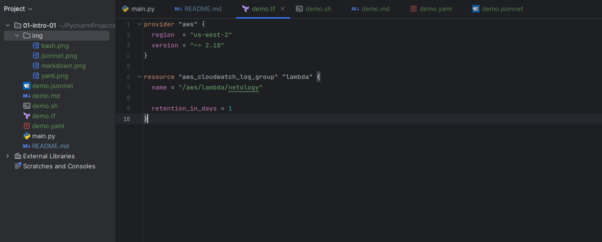
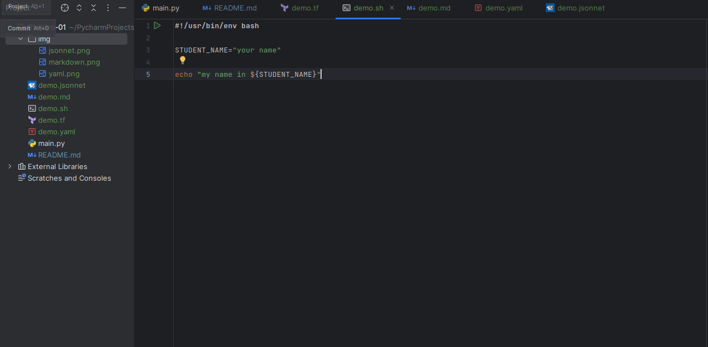
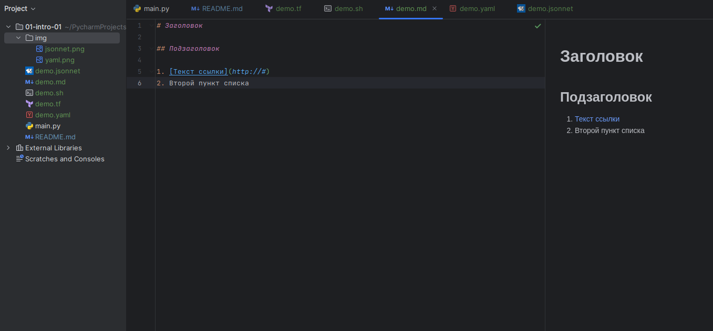
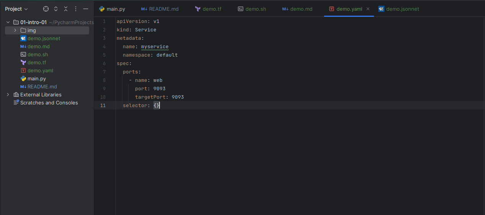
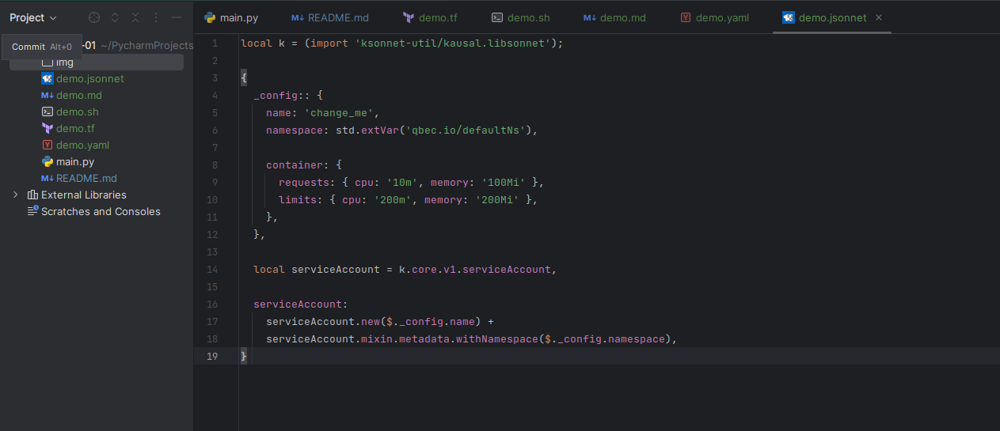

### Задание 1. Подготовка рабочей среды.

**Шаг 1.** Установлен [PyCharm Community Edition](https://www.jetbrains.com/ru-ru/pycharm/)

**Шаг 2.** Установлены плагины:
* Terraform
* MarkDown - уже был установлен.
* Yaml - тоже установлен.
* Jsonnet

**Шаг 3.** Склонирован репозиторий [github.com/netology-code/sysadm-homeworks](https://github.com/netology-code/sysadm-homeworks)

**Шаг 4.** Скопирован код с демо-файлов для проверки плагинов:
* [Terraform](demo.tf) - Terraform:  
* [Bash](demo.sh) - Bash: 
* [Markdown](demo.md) - Markdown: 
* [YAML](demo.yaml) - YAML: 
* [Jsonnet](demo.jsonnet) - Jsonnet: 

### Задание 2. Описание жизненного цикла задачи (разработки нового функционала)

**1. Взаимодействие с клиентом:**
   * Менеджер проекта взаимодействует с клиентом
   * Выслушиваем все хотелки КЛ

**3. Взаимодействие с разработчиками:**

   * Обдумывание путей / сложность реализации задачи
   * Ориентировочные сроки исполнения

**2. Взаимодействие с менеджером проекта:**
   * Обсуждение сроков исполнения
   * Обсуждаем технические сложности реализации задачи 
   * Обсуждаем этапы решения задачи (этапы разработки, тестирования, развертывания, запуска в релиз)

**4. В зависимости от этапов тестирования:**
   * Разворачивание среды для тестирования продукта
   * Разворачивание продукта
   * Тестирование продукта
   * Настройка мониторинга сервисов
   * Подготовка к релизу:
     * сервера 
     * мониторинг
     * автоматизированная интеграция новых версий продукта
     * автоматизированное тестирование основных компонентов
     * автоматизированное резервное копирование

**5. Поддержание взаимосвязи с разработчиками и менеджером проекта.**

**6. Поддержание возможности отката изменений до стабильной версии продукта**

**7. Поддержание масштабируемости функционала и продукта в целом.**